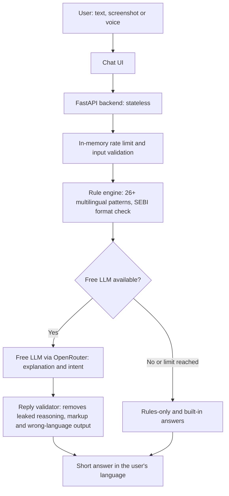

# SANGYAN Shield 🛡️

**A multilingual AI chat assistant that helps Indian retail investors spot investment scams before they pay.**

Built for the **SANGYAN Investor Resilience Hackathon** (Tracks A + E: Digital Fraud & Scam Resilience, Misinformation & Content Literacy).

🔗 **Live demo:** https://YOUR-RENDER-URL.onrender.com
🎥 **Demo video:** YOUR-VIDEO-LINK

---

## The Problem

India's retail investor base is growing fastest in Tier-2 and Tier-3 cities. First-time investors there receive "guaranteed return" tips, fake VIP Telegram groups, fake SEBI claims and withdrawal-fee traps on WhatsApp every day. Most tools are English-only, and victims usually realise the fraud only when their withdrawal is blocked.

## Our Solution

SANGYAN Shield is a ChatGPT-style assistant. The user pastes a suspicious message, uploads or pastes a screenshot, or speaks, and gets a short, plain-language answer **in the same language they used** (English, Hindi, Gujarati or Hinglish):

- a risk level (Low / Medium / High) with a clear note that it is an **indicator, not proof**
- the key red flags and why they matter
- safe next steps (report on cybercrime.gov.in or call 1930, file on SEBI SCORES, tell the bank)
- short, simple answers to general investing questions, with a "Be careful" note on what can go wrong

## Key Features

| Feature | Details |
|---|---|
| **Chat interface** | Clean white ChatGPT/Claude-style UI, large readable text, mobile-first |
| **Replies in your language** | No language menu: the assistant answers in the language and script the user writes or speaks |
| **Text, image and voice input** | Paste text, upload or paste (Ctrl+V) a screenshot, or use the mic (Chrome/Edge) |
| **Hybrid detection** | 26+ deterministic multilingual rules plus an LLM for explanation |
| **Works without AI** | If the AI is unavailable, the rule engine and built-in answers still work |
| **Short, step-by-step replies** | Typed out gradually with a "thinking" indicator, never a wall of text |
| **Chat history on your device** | Saved only in your browser's localStorage, with New chat and Clear all history |
| **Voice conversations** | Spoken questions and replies are saved in the chat, with cancel support |

## How It Works



The **rule engine is the ground truth**: the LLM can add explanation but can never lower a High rule-based risk below Medium.

## What the Rules Detect

Guaranteed or daily returns, "double your money" schemes, urgency and FOMO, insider or operator tips, pump-and-dump language, VIP Telegram/WhatsApp group lures, shortened or look-alike links, false "SEBI approved" claims, SEBI registration number format checks (INA / INH / INZ), OTP/UPI PIN requests, remote-access apps (AnyDesk, TeamViewer), upfront and withdrawal fees, personal UPI payment requests, celebrity or deepfake endorsements, AI trading bot promises, guaranteed IPO allotment, fake demat bonuses, referral/pyramid schemes, rogue APK downloads, recovery scams and unauthorised account handling. Patterns cover English, Hindi (Devanagari and romanized) and Gujarati.

## Hackathon Guardrail Compliance

| Guardrail | How we comply |
|---|---|
| No stock tips, buy/sell/hold or price predictions | Forbidden in the rule engine and system prompt. Requests for tips or platforms are politely declined |
| No promotion of brokers or products | No product or broker is ever named or recommended |
| No monetisation | No ads, fees, upsells or accounts |
| Privacy by design | The server stores nothing. User text and images are never logged or written to disk. Chat history lives only in the user's own browser and can be deleted anytime |
| No unauthorised data collection | No OTP, SMS or financial data is collected, and the assistant warns users never to share them |
| Honest about uncertainty | Never a "scam / not scam" verdict. Every verdict is a risk indicator, not proof. Registration claims are never verified live; users are sent to sebi.gov.in |
| Free stack | FastAPI plus free-tier LLM APIs, hosted on a free Render instance |

## Tech Stack

- **Backend:** Python, FastAPI, Uvicorn, httpx, Pydantic
- **AI:** OpenRouter free models (`:free`), auto-discovered and used with fallback; optional Groq free tier as an additional provider
- **Frontend:** single static HTML/CSS/JS page, no framework, client-side screenshot compression
- **Voice:** browser Web Speech API (recognition and read-aloud)
- **Hosting:** Render free web service
- **Tests:** pytest

## Run Locally

```bash
git clone https://github.com/Darshan-Patil-18/sangyan.git
cd sangyan
python -m venv venv
# Windows: .\venv\Scripts\activate    |    macOS/Linux: source venv/bin/activate
pip install -r requirements.txt
cp .env.example .env      # add your free keys (optional)
uvicorn main:app --host 127.0.0.1 --port 8000 --reload
```

Open http://127.0.0.1:8000. If port 8000 is blocked on your machine, use another port such as 8080.

**Environment variables** (all optional; the app still works without them):

```
OPENROUTER_API_KEY=
GROQ_API_KEY=
TEXT_MODEL=
VISION_MODEL=
```

Run the tests with `python -m pytest tests/ -v`.

## Deploy on Render (free)

- **Build command:** `pip install -r requirements.txt`
- **Start command:** `uvicorn main:app --host 0.0.0.0 --port $PORT`
- **Health check path:** `/health`
- Add the API keys as environment variables in the Render dashboard. Never commit `.env`.

Free instances sleep after inactivity, so the first request can take 30 to 60 seconds. Free AI models have request limits, which is why the rule engine and built-in answers keep the app useful when the AI is unavailable.

## Impact and Scalability

- **Impact:** helps first-time investors pause and verify before paying, in the language they actually use, with clear next steps
- **Scalable:** stateless backend, tiny front end, runs on low-end phones and weak networks
- **Next steps:** more regional languages (via Bhashini), WhatsApp or IVR access for low-literacy users, community scam-pattern reporting, and a larger multilingual test set

## Official Channels We Point Users To

- Verify intermediaries: [sebi.gov.in](https://sebi.gov.in)
- Report cyber fraud: call **1930** or visit [cybercrime.gov.in](https://cybercrime.gov.in)
- Investor complaints: [scores.sebi.gov.in](https://scores.sebi.gov.in)

## Disclaimer

SANGYAN Shield gives risk indicators, **not proof, legal advice or investment advice**. It is an independent hackathon project and is not affiliated with SEBI, NSDL or IIT (BHU).

---

Built by **Darshan Patil** for the SANGYAN Hackathon.
